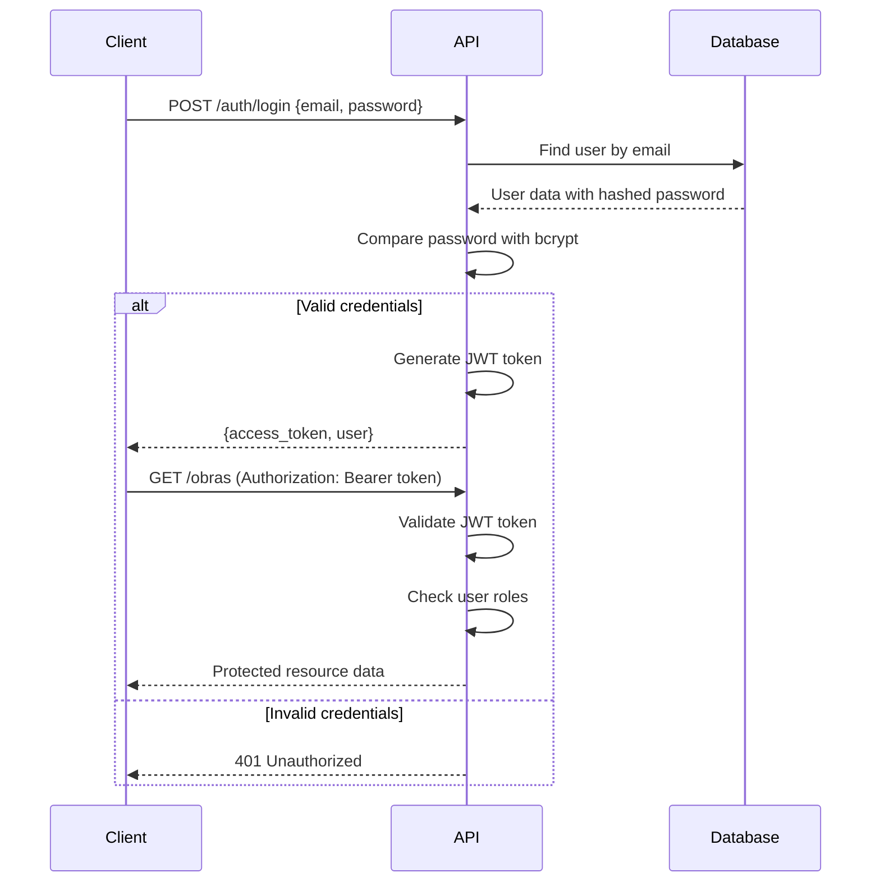

## Introduction

The Yucatan Public Works API uses **JWT (JSON Web Token)** based authentication to secure endpoints and control access to resources. This authentication system ensures that only authorized users can access the API and that different user roles have appropriate permissions.

## How Authentication Works

The API implements a token-based authentication flow:

1. **User Login**: Client sends credentials (email and password) to the `/auth/login` endpoint
2. **Credential Validation**: Server validates credentials using bcrypt password comparison
3. **Token Generation**: If valid, server generates a JWT token containing user information
4. **Token Usage**: Client includes the token in subsequent API requests
5. **Token Verification**: Server validates the token on each protected endpoint request
6. **Access Control**: Server checks user roles to determine if access is allowed

<Steps>
  <Step title="Send Login Request">
    Client sends email and password to `/auth/login`
  </Step>
  <Step title="Validate Credentials">
    Server validates the user credentials against the database using bcrypt
  </Step>
  <Step title="Generate JWT Token">
    Server creates a JWT token with user information (id, email, roles)
  </Step>
  <Step title="Return Token">
    Server returns the access token and user data to the client
  </Step>
  <Step title="Use Token">
    Client includes the token in the Authorization header for protected requests
  </Step>
  <Step title="Verify and Authorize">
    Server verifies the token and checks role permissions on each request
  </Step>
</Steps>

## Authentication Flow



## Security Features

The authentication system implements several security best practices:

### Password Hashing with bcrypt

All passwords are hashed using **bcrypt** before being stored in the database. This ensures that even if the database is compromised, passwords remain secure.

```typescript auth.service.ts:18
// Password validation using bcrypt
if (user && bcrypt.compareSync(pass, user.password)) {
  const { password, ...result } = user;
  return result;
}
```

### JWT Token Security

JWT tokens are signed with a secret key and include:
- **Expiration checking**: Tokens expire after a configured time period
- **Signature verification**: Ensures tokens haven't been tampered with
- **Payload encryption**: User data is encoded in the token

```typescript jwt.strategy.ts:9
super({
  jwtFromRequest: ExtractJwt.fromAuthHeaderAsBearerToken(),
  ignoreExpiration: false, // Tokens must not be expired
  secretOrKey: 'CLAVE_SECRETA_SUPER_DIFICIL',
});
```

<Warning>
  In production environments, the JWT secret key should be stored in environment variables, not hardcoded in the source code.
</Warning>

### Role-Based Access Control

The API uses role-based access control (RBAC) to restrict access to certain endpoints based on user roles. This is enforced through:

- **JwtAuthGuard**: Validates the JWT token
- **RolesGuard**: Checks if the user has the required role
- **@Roles() Decorator**: Specifies which roles can access an endpoint

## Protected Endpoints

Most endpoints in the API require authentication. The authentication guards are applied at the controller level:

```typescript obras.controller.ts:23
@Controller('obras')
@UseGuards(JwtAuthGuard, RolesGuard)
export class ObrasController {
  // All endpoints require valid JWT token
}
```

## Next Steps

<CardGroup cols={2}>
  <Card title="JWT Tokens" icon="key" href="/authentication/jwt-tokens">
    Learn how to obtain and use JWT tokens
  </Card>
  <Card title="Roles & Permissions" icon="shield" href="/authentication/roles">
    Understand role-based access control
  </Card>
</CardGroup>
